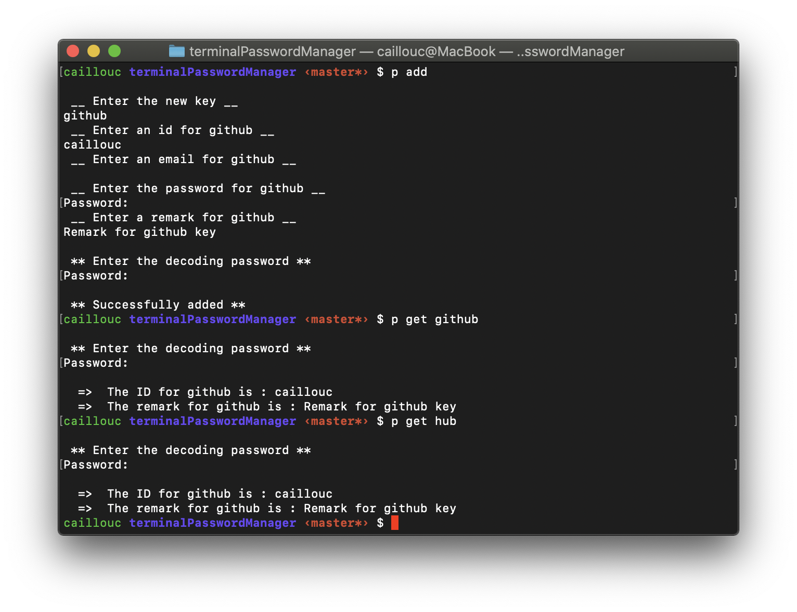

# Terminal Password Manager {ignore=true}

[TOC]

## Description 

#### General 
This repository provides you a password manager in your terminal (mac OS). 
You can easly save your passwords but also an IDs, a mails or a any remarks. 

All your passwords are protected with one general password that will be ask you, during the installation. You can improve the level of security of this password manager, by moving to a flash drive a file named `.saveSalt` (created during the installation) that is needed to decode your data. If this file is moved on a flash drive, you will thus need to plug it in, each time you want to use the password manager.

The file `.save.json` is used to save all you information and `.saveSalt` is used for the encryption. 

Ther is two differents way to retrieve a password : 

1) `get` : **Copy in your clipboad for 10 seconds the password** and display the ID, the mail and the remark if there is one. 
2) `see`: **Copy in your clipboard the passord** and display the ID, the mail, the *password* and the remark if ther is one. 

All you passwords and their informations will be link to a key. This key we be used find the password when you will need it. 

#### Example of execution



The search for the correct key is tolerent and the password manager will ask you to chose the correct key if several passwords match the research. 
All the option are listed in the **How to use** section. 


## How to install 

* First clone this repository. 

* Then run the following command to install necessary packages.

```zsh
pip3 install cryptography
```

* Then go in the folder of the project and run this command to initialise your password manager. This will ask you a password that will be use to encode your future data. It will also create two files `.save.json` and `.saveSalt`. 
**Don't modify or lost those files, if you don't want to lose all your saved informations** 

```zsh
python3 passw.py init
```

> If you want to move `.saveSalt` on a flash drive as mentioned in the description you will need to edit in `passw.py` the following constant : `saltFileName`. 
> For example : `saveFileName = /PATH/TO/.saveSalt` 

> For more safety you can also keep in a safe place a copy of `.saveSalt` 

* In order to be usable in the terminal, add this following line in you `.bashrc` or `.zshrc` file. You need to write the path to this project in `"PATH/TO/PROJECT"` (can be find running `pwd` in a terminal while in the project).

```zsh
# password manager shortcut
p (){
        DIR="`pwd`"
        builtin cd "/PATH/TO/PROJECT"
        case $1 in
                "add") python3 passw.py add          ;;
                "get") python3 passw.py get "$2"     ;;
                "see") python3 passw.py see "$2"     ;;
                "delete") python3 passw.py delete    ;;
                "edit") python3 passw.py edit        ;;
                *) echo "Unvalid argument"           ;;
        esac
        builtin cd $DIR
}
```

## How to use 

* To *add* a password run : 

```zsh 
p add
```

> The first thing asked by thsi command is the the key that will be used to retreive your password. 

* To *delete* a password run : 

```zsh 
p delete
```

* To *edit* a password run :

```zsh 
p edit
```

* To *get* a password : 

```zsh 
p get <key>
```

* To *see* a password : 

```zsh 
p see <key>
```

For `get` and `see`, \<key\> represents the key linked to the password your looking for. 
This \<key\> does not have to be exact, the password manager is tolerent and will ask you if several passwords match the search. 

> `p get ""` will list all the current keys that are registered in the password manager


